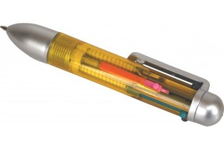

# MagicPen



Create composable extensible styled text in both consoles and
browsers.

## Installation

### Node

Install it with NPM or add it to your `package.json`:

```
$ npm install magicpen
```

Then:

```js
var magicpen = require('magicpen');
pen = magicpen('ansi');
pen.red('Hello').sp().green('world!');
console.log(pen.toString());
```

### Browser

Include `magicpen.js`.

```html
<script src="magicpen.js"></script>
```

this will expose the `magicpen` function under the following namespace:

```js
var expect = weknowhow.magicpen;
pen.red('Hello').sp().green('world!');
console.log(pen.toString());
```

### RequireJS

Include the library with RequireJS the following way:

```js
require.config({
    paths: {
        magicpen: 'path/to/magicpen
    }
});

define(['magicpen'], function (expect) {
    pen = magicpen('ansi');
    pen.red('Hello').sp().green('world!');
    console.log(pen.toString());
});
```

## Usage

You create a new `magicpen` instance by calling the `magicpen`
function. The function takes one parameter, the output mode. By
default the `plain` mode is console output without colors. You can
also choose the `ansi` mode or the `html` mode. The `ansi` mode will
format the output for the console with colors and basic styling. The
`html` mode will format the output in html with colors and basic
styling.

Let's try to create out first `magicpen` in `ansi` mode:

```js
magicpen('ansi');
pen.red('Hello').sp().green('world!');
console.log(pen.toString());
```

The above snippet create a new `magicpen` in `ansi` mode and writes
_Hello_ in red, space and _world!_ in green and prints the formatted
output to the console. This will produce the following output:


